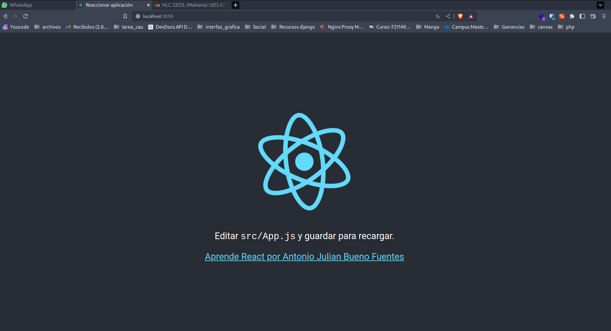
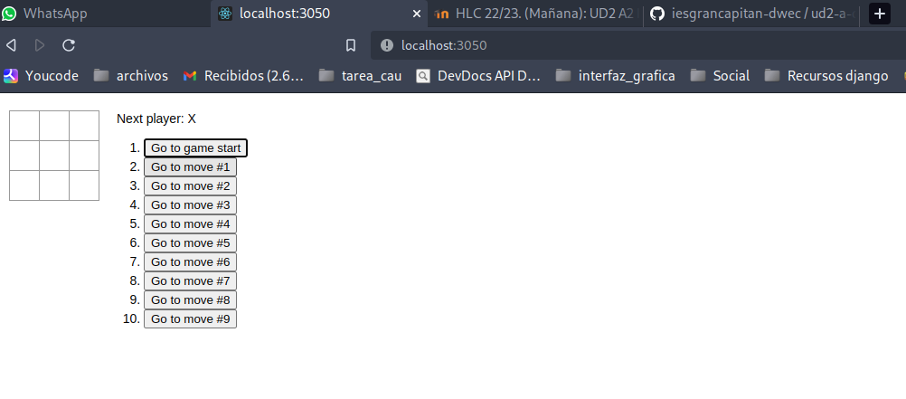
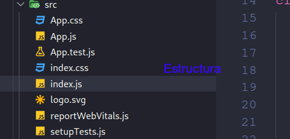
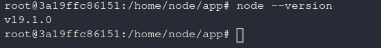

# Actividad UD2 A2 Instalación del entorno local git 
## Mostrar cambiro de src/app.js

## TIC_TAC_TOE

### Estructura de carpetas

---
## Qué es Node.js 
### Node.js es un entorno de ejecución para JavaScript construido con el motor de JavaScript V8 de Chrome. Node.js usa un modelo de operaciones E/S sin bloqueo y orientado a eventos, que lo hace liviano y eficiente. El ecosistema de paquetes de Node.js, npm, es el ecosistema más grande de librerías de código abierto en el mundo.
---
## Indica la versión de node que tienes instalada

---
## Qué es npx
### npx es un ejecutable que viene con npm 5.2+ y ejecuta paquetes npm. Es un comando que se puede usar para ejecutar paquetes npm sin tener que instalarlos de forma global. Esto es útil para ejecutar paquetes de una sola vez, como por ejemplo, ejecutar un paquete de una sola vez para crear un proyecto.
---
## Qué es create-react-app
### Es un paquete de npm que nos permite crear una aplicación React de forma rápida y sencilla. Este paquete nos permite crear una aplicación React con todas las dependencias necesarias para que podamos empezar a trabajar con ella.
---
## Indica comando que inicia el servidor de desarrollo.
### npm start
---
## Indica el puerto donde por defecto se ejecuta la aplicación REACT
### 3000 ese es el puerto por defecto 
---
